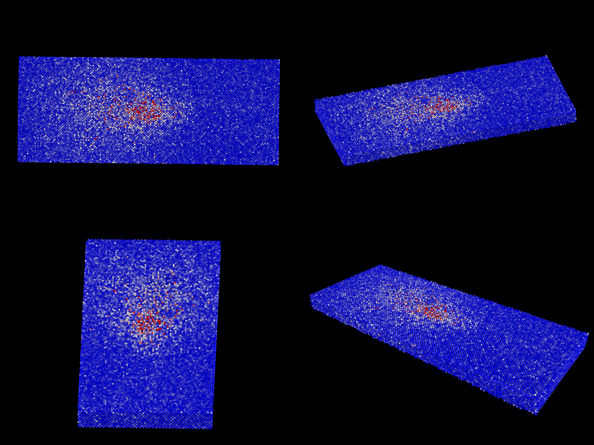

# Laser-based Laminated Object Manufacturing



## Overview

This repository contains LAMMPS (Large-scale Atomic/Molecular Massively Parallel Simulator) scripts for molecular dynamics simulation of laser-based laminated additive manufacturing. The simulation models the laser welding process of two aluminum plates stacked on top of each other, where a high-power laser beam moves along the centerline to join them together.

## Description

The simulation captures the physical phenomena occurring during laser-based laminated object manufacturing, including:

- Heat transfer and thermal gradients
- Melting and solidification of aluminum
- Weld pool dynamics
- Residual stress formation
- Microstructural defects and grain boundaries
- Cooling phase evolution

The laser beam moves sequentially along the length of the plates, creating a continuous weld seam at the interface between the two stacked aluminum sheets.

## Features

- **High-resolution atomic simulation** with thin plate geometry
- **Concentrated laser beam** with adjustable radius and power
- **Moving heat source** that progresses along the weld line
- **Temperature visualization** through kinetic energy computation
- **Stress analysis** including von Mises stress and hydrostatic pressure
- **Defect detection** using centro-symmetry parameter
- **Multi-stage cooling** for realistic solidification

## Requirements

- LAMMPS (with EAM potential support)
- Al99.eam.alloy potential file
- Visualization software (OVITO, VMD, or similar)

## Installation

1. Clone this repository:
```bash
git clone https://github.com/akshansh11/Laser-based-Laminated-Object-Manufacturing.git
cd Laser-based-Laminated-Object-Manufacturing
```

2. Ensure you have LAMMPS installed with the required packages:
   - MANYBODY package (for EAM potentials)
   - OPENMP or other parallel computing packages

3. Download or ensure you have the Al99.eam.alloy potential file in your working directory

## Usage

Run the simulation using LAMMPS:
```bash
lmp -in laminated_manufacturing.lammps
```

Or with MPI for parallel execution:
```bash
mpirun -np 4 lmp -in laminated_manufacturing.lammps
```

## Output Files

The simulation generates several output files:

- `laminated_welding.lammpstrj` - Main trajectory file with temperature and defect data
- `temperature_field.lammpstrj` - Temperature distribution over time
- `stress_evolution.lammpstrj` - Stress field evolution
- `final_structure.lammpstrj` - Final welded structure with defect analysis
- `final_laminated_structure.data` - Final atomic coordinates
- `restart.laminated.*` - Restart files for continuing simulation

## Visualization

To visualize the results in OVITO:

1. Load the `.lammpstrj` file in OVITO
2. Color atoms by:
   - `c_ke_per_atom` to see temperature distribution
   - `c_centro` to visualize defects and weld zone
   - `v_atom_temp` for direct temperature in Kelvin
   - `v_von_mises_stress` for stress analysis

The weld trail will appear as a region of high temperature and structural disorder along the centerline.

## Simulation Parameters

- **Plate dimensions**: 100 x 40 x 2.5 lattice units (each plate)
- **Laser beam radius**: 3 units (adjustable)
- **Peak temperature**: 2800 K
- **Material**: Aluminum (FCC structure, lattice parameter 4.05 Å)
- **Timestep**: 0.001 ps

## Customization

You can modify the following parameters in the script:

- Beam radius by adjusting the weld zone regions
- Laser power by changing the target temperature in Langevin thermostat
- Plate thickness by modifying the region definitions
- Number of laser positions for finer or coarser progression
- Cooling rates in the multi-stage cooling phase

## Author

**Akshansh Mishra**

GitHub: [@akshansh11](https://github.com/akshansh11)

## License

This work is licensed under the Creative Commons Attribution-NonCommercial 4.0 International License.

[](http://creativecommons.org/licenses/by-nc/4.0/)

To view a copy of this license, visit http://creativecommons.org/licenses/by-nc/4.0/ or send a letter to Creative Commons, PO Box 1866, Mountain View, CA 94042, USA.

### You are free to:

- **Share** — copy and redistribute the material in any medium or format
- **Adapt** — remix, transform, and build upon the material

### Under the following terms:

- **Attribution** — You must give appropriate credit, provide a link to the license, and indicate if changes were made.
- **NonCommercial** — You may not use the material for commercial purposes.

## Citation

If you use this code in your research, please cite:
```
Mishra, A. (2025). Laser-based Laminated Object Manufacturing LAMMPS Simulation.
GitHub repository: https://github.com/akshansh11/Laser-based-Laminated-Object-Manufacturing
```

## Acknowledgments

This simulation is built using LAMMPS, developed by Sandia National Laboratories.

## Contact

For questions, suggestions, or collaborations, please open an issue on GitHub or contact through the repository.

---

**Note**: This is a research and educational tool. Results should be validated against experimental data for specific applications.
